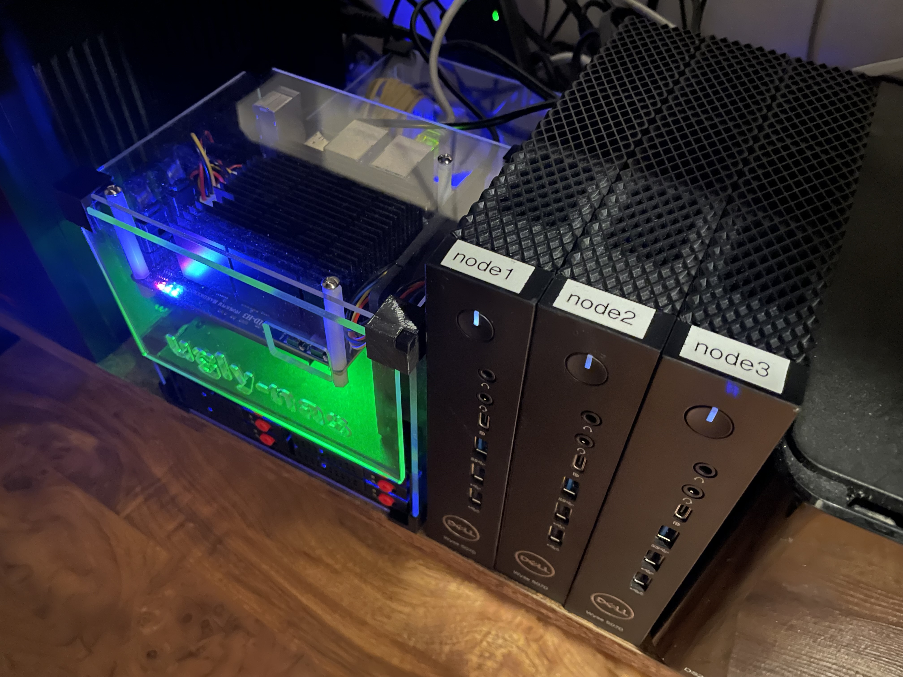

## dumb-provisioner

### What's that?

Just a basic script and set of configs that will help you boot/install Wyse terminals with the Debian stable over network.

### What exactly is pxe.sh doing?

It downloads the netboot tarball, extracts kernel/initrd and creates boot image.

### How to use it?

After pxe.sh is successfully finished all the content of pxe/ directory should be copied to the place from which it will be served over tftp.
In my case it's Mikrotik router with below configuration:

DHCP & TFTP:

    [admin@Mikrotik] /ip> export
    # jan/25/2023 18:05:26 by RouterOS 7.7
    /ip pool
    add name=dhcp_lab ranges=10.10.20.105-10.10.20.110
    /ip dhcp-server
    add address-pool=dhcp_lab interface=bridge_lab name=dhcp_lab
    /ip address
    add address=10.10.20.97/28 comment=LAB interface=bridge_lab network=10.10.20.96
    /ip dhcp-server network
    add address=10.10.20.96/28 boot-file-name=bootx64.efi dns-server=10.10.20.97 gateway=10.10.20.97 netmask=28 next-server=10.10.20.97
    /ip tftp
    add ip-addresses=10.10.20.96/28 real-filename=pxe/
    /ip tftp settings
    set max-block-size=8192

So all files from pxe/ directory needs to be copied into pxe/ directory on the router.
Of course you can use software solutions instead. 

### What's rationale behind it?

Well I've got 3 Dell Wyse terminals for my homelab. And since it's homelab then from time to time I need to reinstall everything from scratch which means I have to connect keyboard and monitor to all three nodes. 
I was tired of it. Now all I have to do is `ssh root@nodeX ./reinstall.sh`

### Wait what? 

Configuration included in this repo will not only install these nodes but also tools from Dell that allows to change BIOS/UEFI settings from Linux system.

